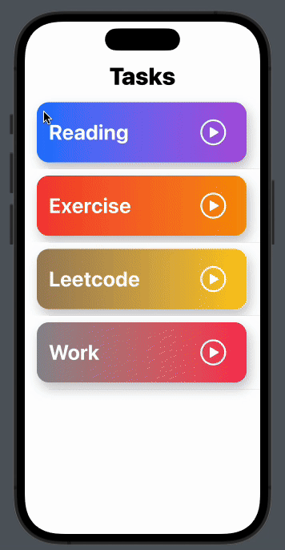

# Focus Timer (Study Timer) Project

Focus Timer is a simple app designed to help users manage their focus sessions and keep track of daily progress effectively. With Study Timer, users can set custom study durations, take breaks between study sessions, and track their progress over time.

## Features (In Progress)
1. Custom Focus Durations: 
Set daily goals for your focus sessions. The app keeps track and reminds you of your goals, helping you plan your day and achieve your targets.
2. Siri, notification and Apple Watch Integration: Access Study Timer seamlessly through Siri commands, time sensitive notifications and on your Apple Watch, ensuring you stay productive wherever you are.
3. Progress Tracking: Monitor your study sessions and track your progress over time. Gain insights into your study habits and make informed decisions for improvement.
4. Aesthetic Interface: Enjoy an aesthetically designed interface that promotes focus and relaxation. With user-friendly navigation and a soothing design, the app enhances your focus experience.

## Demo 

